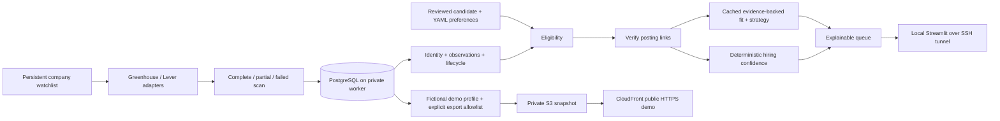

# Job Intel v2 architecture

The existing five-stage legacy workflow is retained. Scheduled v2 work uses ordinary services rather than making database writes or deterministic rules into agents.

V2 tables use the `v2_` prefix so original v1 tables and trial controls remain usable. Alembic owns schema changes; the initial revision freezes its schema separately from current application metadata. Source identity is `(company_id, source, external_id)`; aliases do not replace the primary identity. Application state does not control listing lifecycle.

Every company reconciliation is one transaction. Failed/partial scans cannot advance missing counters. Complete absences close only after the configured count and time grace. Retry of a committed scan ID is a no-op. Returning IDs are reposts; new IDs with matching company/title/location are only possible-repost relationships.

Fit/strategy cache keys include content, candidate, preferences, model, company tier and evaluator version. Confidence recomputes from source observations and link checks. Candidate/posting evidence is validated against exact excerpts. Budget reservations serialize independently from scans, across both supported database engines, and remain spent on uncertain provider outcomes.

The public exporter uses only evaluations belonging to the current fictional profile; it never serializes repository rows or model output wholesale. Human application notes, candidate quotations, credentials and private profile scores remain outside public artifacts.
